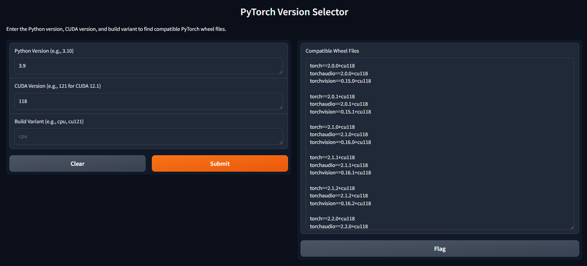

# TorchVersionSpecifier
TorchVersionSpecifier is a tool designed to simplify the process of finding compatible PyTorch, TorchVision, and Torchaudio versions for various Python and CUDA environments. If you've ever struggled to determine the correct library versions for your setup, this tool provides a streamlined solution.



## Problem Statement
PyTorch, TorchVision, and Torchaudio releases are tightly coupled to specific Python and CUDA versions. Determining the correct versions for your environment can be a tedious and error-prone process, especially if you're managing multiple projects or using diverse environments. TorchVersionSpecifier automates this by presenting a clear and concise list of compatible versions based on your specified criteria.

---

## Features
- **Environment-Aware Compatibility Checks**: Quickly find matching library versions for your Python and CUDA versions.
- **Up-to-Date Information**: The tool pulls its compatibility data directly from the relevant repositories, ensuring accuracy even if new releases are shipped.
- **Flexible Configuration**: Use either `conda` or `pip` for environment setup.
---

## Installation

You can set up the environment using either `conda` or `pip`. Follow the instructions below based on your preference.

### Using `conda`

1. Clone the repository:
   ```bash
   git clone https://github.com/eoffermann/TorchVersionSpecifier.git
   cd TorchVersionSpecifier
   ```
2. Create the environment:
   ```bash
   conda env create -f environment.yml
   ```
3. Activate the environment:
   ```bash
   conda activate TorchVersionSpecifier
   ```

### Using `pip`

1. Clone the repository:
   ```bash
   git clone https://github.com/eoffermann/TorchVersionSpecifier.git
   cd TorchVersionSpecifier
   ```
2. Install the dependencies:
   ```bash
   python -m venv TorchVersionSpecifier
   source TorchVersionSpecifier/bin/activate  # Use `TorchVersionSpecifier\Scripts\activate` on Windows
   pip install -r requirements.txt
   ```

---

## Usage

TorchVersionSpecifier is run via the command line but includes an optional gradio interface. You specify the desired Python version and CUDA version to retrieve a list of compatible library versions.

```
usage: run.py [-h] [-i] [-g] [-p PYTHON] [-c CUDA] [-b BUILD]

PyTorch Version Selector

optional arguments:
  -h, --help            show this help message and exit
  -i, --interactive     Launch interactive mode
  -g, --gradio          Launch Gradio interface
  -p PYTHON, --python PYTHON
                        Specify Python version (e.g., 3.10)
  -c CUDA, --cuda CUDA  Specify CUDA version (e.g., 121 for CUDA 12.1)
  -b BUILD, --build BUILD
                        Specify build variant (e.g., cpu, cu121)
```

### Example:
```bash
python run.py -p 3.9 -c 121
```

### Output:
The tool will display a list of compatible versions:
```
Compatible versions for Python 3.9, CUDA 121, and variant any:

torch==2.1.0+cu121
     torchaudio==2.1.0+cu121
     torchvision==0.16.0+cu121

torch==2.1.1+cu121
     torchaudio==2.1.1+cu121
     torchvision==0.16.1+cu121

...
```

You can use the output to install the required versions via `pip` or integrate them into your project's environment configuration.

---

## Community
We welcome contributions! Here are a few ways you can get involved:

1. **Feature Suggestions**: Have an idea? Share it on the [Discussions](https://github.com/eoffermann/TorchVersionSpecifier/discussions) page.
2. **Bug Reports**: If you encounter any issues, report them under the [Issues](https://github.com/eoffermann/TorchVersionSpecifier/issues) tab.
   - **Note**: Please reserve `Issues` for bugs and developer effort management. Use `Discussions` for feature requests.
3. **Pull Requests**: Contribute directly to the codebase by submitting pull requests.

### Contribution Workflow
- Fork the repository.
- Create a feature branch:
  ```bash
  git checkout -b feature/your-feature
  ```
- Commit your changes:
  ```bash
  git commit -m "Add your feature description here"
  ```
- Push to your fork:
  ```bash
  git push origin feature/your-feature
  ```
- Open a pull request to the main repository.

---

## License
TorchVersionSpecifier is licensed under the MIT License. See [LICENSE](LICENSE) for more details.

---

Happy coding!
